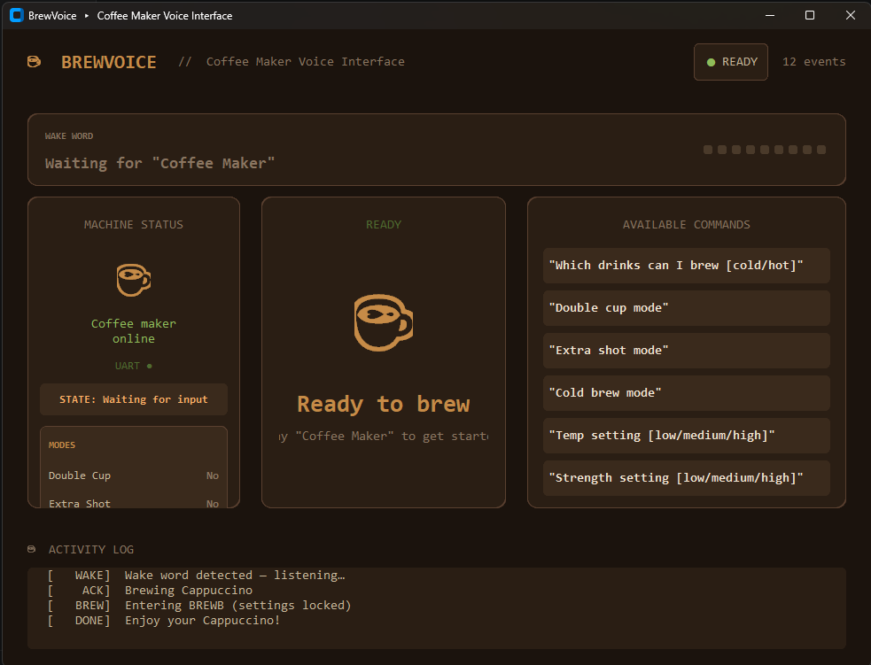

# DEEPCRAFT&trade; Voice Assistant — Coffee Maker Demo



This repository contains a complete end-to-end demo of an Infineon DEEPCRAFT&trade; Voice Assistant
running on the [PSOC&trade; Edge E84 AI Kit](https://www.infineon.com/KIT_PSE84_AI), paired with a
PC-hosted "mock display" that imitates the touch screen of a smart coffee maker. Spoken commands
captured by the kit are streamed over UART to the dashboard, which reacts in real time —
selecting drinks, brewing, toggling cold brew / extra shot, adjusting temperature / strength /
volume, and more.

## Repository layout

| Path | Description |
|------|-------------|
| [psoc-e84-ai/](psoc-e84-ai/) | ModusToolbox&trade; embedded application for the PSOC&trade; Edge E84 AI Kit (CM33-S, CM33-NS, CM55 projects). |
| [mock_display/](mock_display/) | Python `customtkinter` dashboard that renders the coffee-maker UI and listens to the kit over a serial port. |
| [coffee_maker.vaproj](coffee_maker.vaproj) | DEEPCRAFT&trade; Voice Assistant project file. Import this into your workspace at <https://deepcraft-voice-assistant.infineon.com> to view or modify the wake word and command model used by this demo. |

> `mtb_shared/` (shared ModusToolbox&trade; middleware: audio front-end, voice core, FreeRTOS, etc.)
> is **not** checked into this repository — it is `.gitignore`d. The folder is created and
> populated on the fly the first time you run `make getlibs` (see section 2.1).

## Hardware required

- PSOC&trade; Edge E84 AI Kit (`KIT_PSE84_AI`)
- USB-C cable (kit ships with one) — connect to the **KitProg3** USB connector
- Windows PC

## High-level flow

1. Install ModusToolbox&trade; 3.8 and the LLVM Embedded Toolchain.
2. Bootstrap the embedded project with `make getlibs` from modus-shell.
3. Build and flash the kit with `make program`.
4. Set up a Python virtual environment and launch the mock display.
5. Reset the kit — it will print to the dashboard's serial port. Speak the wake word and try commands.

---

## 1. Install the embedded toolchain

### 1.1 ModusToolbox&trade; 3.8

Download and install ModusToolbox&trade; 3.8 from
<https://www.infineon.com/modustoolbox>. Follow the
[ModusToolbox&trade; tools package installation guide](https://www.infineon.com/ModusToolboxInstallguide).
The installer also provides **modus-shell**, the bash environment used to build the project on Windows.

### 1.2 LLVM Embedded Toolchain for Arm&reg;

This project's default toolchain is the
[LLVM Embedded Toolchain for Arm&reg; v19.1.5](https://github.com/ARM-software/LLVM-embedded-toolchain-for-Arm/releases/tag/release-19.1.5).
Install it to a path of your choice (for example `C:\llvm\LLVM-ET-Arm-19.1.5-Windows-x86_64`).

Tell the build system where the compiler lives by setting the `CY_COMPILER_LLVM_ARM_DIR`
environment variable, e.g.:

```powershell
setx CY_COMPILER_LLVM_ARM_DIR "C:\llvm\LLVM-ET-Arm-19.1.5-Windows-x86_64"
```

Alternatively, set the same variable in [psoc-e84-ai/common_app.mk](psoc-e84-ai/common_app.mk).
Open a fresh shell after setting environment variables.

---

## 2. Build and flash the embedded application

All embedded build commands run from **modus-shell** (Start Menu → *modus-shell*). On Windows
the project's `make` targets will not run reliably from PowerShell or `cmd.exe`.

### 2.1 Bootstrap the project (one time)

```bash
cd /path/to/va-coffee-maker-demo/psoc-e84-ai
make getlibs
```

`make getlibs` downloads the middleware referenced by the three sub-projects
(`proj_cm33_s`, `proj_cm33_ns`, `proj_cm55`) into a freshly created `mtb_shared/` folder at
the repository root. That folder is git-ignored, so it does not exist in a clean clone — this
step creates it. The first run can take several minutes.

### 2.2 Build and program the kit

Connect the AI kit to your PC via the **KitProg3** USB-C port, then run:

```bash
make program TOOLCHAIN=LLVM_ARM TARGET=APP_KIT_PSE84_AI
```

`make program` compiles all three CPU projects and flashes the resulting image to the kit's
external QSPI flash over KitProg3. `TOOLCHAIN` and `TARGET` already default to the values
above for this repo, so a plain `make program` is also fine.

To rebuild without flashing, use `make build`. To clean, use `make clean`.

> If `make program` fails to find the kit, confirm the KitProg3 firmware is up to date via
> the **Firmware Loader** tool installed with ModusToolbox&trade;.

---

## 3. Set up the mock display (PC dashboard)

The dashboard is a Python `customtkinter` app that opens a COM port, parses event lines emitted
by the kit, and animates the coffee-maker UI accordingly.

Run all of the following from **PowerShell** at the repository root.

### 3.1 Allow venv activation in this session

PowerShell blocks unsigned scripts by default. Allow them for the current session only:

```powershell
Set-ExecutionPolicy -Scope Process -ExecutionPolicy RemoteSigned
```

### 3.2 Create and activate the virtual environment

```powershell
cd .\mock_display
py -m venv .venv
.\.venv\Scripts\Activate.ps1
```

Your prompt should now be prefixed with `(.venv)`.

### 3.3 Install dependencies

```powershell
py -m pip install --upgrade pip
py -m pip install -r requirements.txt
```

This installs `customtkinter`, `pyserial`, `bleak`, and `Pillow`.

### 3.4 Identify the KitProg3 COM port

In **Device Manager** under *Ports (COM & LPT)*, locate the **KitProg3 USB-UART** entry and
note its `COMx` number.

### 3.5 Launch the dashboard

```powershell
py .\voice-dashboard.py COM5
```

Replace `COM5` with the port from the previous step. Omit the argument to use the default
(`COM5`), or pass `--test` to drive the UI from the console without opening a serial port.

---

## 4. Run the demo

1. With the dashboard running and connected to the KitProg3 COM port, press the **reset**
   button on the AI kit.
2. The dashboard receives `---RESET COMPLETE---` from the kit and returns to the IDLE screen.
3. Speak the wake word **"OK Infineon"**. The kit's blue LED begins breathing, and the
   dashboard shows it is awake.
4. Speak a command — for example *"Show me hot drinks"*, *"Make me a cappuccino"*,
   *"Toggle extra shot"*, *"Set strength to high"*, *"Yes"* / *"No"* to confirm, or *"Stop"*.
5. The dashboard updates accordingly. The full UART protocol is documented at the top of
   [mock_display/voice-dashboard.py](mock_display/voice-dashboard.py).

### Push to talk

On the AI kit, press **USER BTN1** to skip the wake word and speak a command directly.

---

## 5. Customizing the voice model

The wake word and command set live in [coffee_maker.vaproj](coffee_maker.vaproj).

1. Sign in to <https://deepcraft-voice-assistant.infineon.com> and **import** the `.vaproj`
   file into your workspace (use the cloud tool's *Import project* action — the file is not
   opened directly).
2. Edit intents / commands / wake word as needed and generate a new deployment package.
3. *(Optional)* Use the cloud tool's built-in **Test** feature to try the modified model
   directly in the browser (microphone-based) before generating a deployment package. This
   lets you validate wake-word and command recognition without rebuilding or re-flashing the
   kit.
4. Copy the generated files into
   `psoc-e84-ai/proj_cm55/source/voice_assistant/va_models/<your-project>/` and update
   `DEEPCRAFT_PROJECT_NAME` in [psoc-e84-ai/common.mk](psoc-e84-ai/common.mk).
5. Re-run `make program` and reset the kit.

If you add new commands, extend the UART event handling in
[mock_display/voice-dashboard.py](mock_display/voice-dashboard.py) so the dashboard reacts to them.

---

## Troubleshooting

| Symptom | Try |
|---------|-----|
| `make: command not found` | You are not in **modus-shell**. Open it from the Start menu. |
| Build fails with "compiler not found" | `CY_COMPILER_LLVM_ARM_DIR` is not set, or points at the wrong folder. Open a new shell after `setx`. |
| `make program` cannot find the kit | Check the USB cable is in the **KitProg3** port (not the USB-Device port) and update KitProg3 firmware via the Firmware Loader. |
| Dashboard prints `could not open port 'COMx'` | The port is wrong, or another application (Tera Term, PuTTY, another dashboard instance) has it open. Close other consumers and re-check Device Manager. |
| `Activate.ps1 cannot be loaded` | Re-run the `Set-ExecutionPolicy` command in section 3.1 in the current PowerShell window. |
| Voice assistant stops responding after ~15–30 minutes | The bundled audio / voice middleware is evaluation-licensed. Contact Infineon for an unlimited license. |

---

## References

- Embedded project README: [psoc-e84-ai/README.md](psoc-e84-ai/README.md)
- Design and implementation: [psoc-e84-ai/docs/design_and_implementation.md](psoc-e84-ai/docs/design_and_implementation.md)
- Using the code example: [psoc-e84-ai/docs/using_the_code_example.md](psoc-e84-ai/docs/using_the_code_example.md)
- DEEPCRAFT&trade; Voice Assistant cloud tool: <https://deepcraft-voice-assistant.infineon.com>
- PSOC&trade; Edge E84 AI Kit: <https://www.infineon.com/KIT_PSE84_AI>
