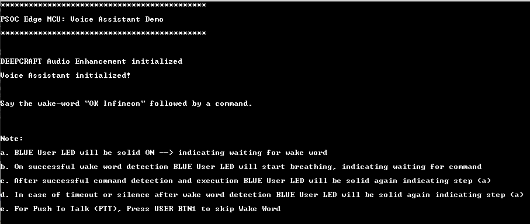

# PSOC&trade; Edge MCU: DEEPCRAFT&trade; Voice Assistant deployment

This code example demonstrates how to use Infineon's PSOC&trade; Edge MCU to deploy DEEPCRAFT&trade; Voice Assistant (VA) models to detect wake words and spoken commands using natural language.

This code example has a three project structure: CM33 secure, CM33 non-secure, and CM55 projects. All three projects are programmed to the external QSPI flash and executed in Execute in Place (XIP) mode. Extended boot launches the CM33 secure project from a fixed location in the external flash, which then configures the protection settings and launches the CM33 non-secure application. Additionally, CM33 non-secure application enables CM55 CPU and launches the CM55 application.

> **Note:**
> 1. The audio and voice middleware included in this example has a limited operation of about 15 and 30 minutes. For the unlimited license, contact Infineon support
> 2. This code example supports only the Arm&reg; and LLVM compilers, which you need to install separately. See the **Software Setup** section for more information

This code example also supports identification of users with Voice ID. This feature is disabled by default and can be enabled at compile-time. Once this feature is enabled, user needs to enroll by speaking for ~10 seconds and Voice ID will identify the user ID when user speaks the command after wake word detection.

[View this README on GitHub.](https://github.com/Infineon/mtb-example-psoc-edge-voice-assistant-deploy)

[Provide feedback on this code example.](https://yourvoice.infineon.com/jfe/form/SV_1NTns53sK2yiljn?Q_EED=eyJVbmlxdWUgRG9jIElkIjoiQ0UyNDE0MTAiLCJTcGVjIE51bWJlciI6IjAwMi00MTQxMCIsIkRvYyBUaXRsZSI6IlBTT0MmdHJhZGU7IEVkZ2UgTUNVOiBERUVQQ1JBRlQmdHJhZGU7IFZvaWNlIEFzc2lzdGFudCBkZXBsb3ltZW50IiwicmlkIjoicm9kb2xmby5sb3NzaW9AaW5maW5lb24uY29tIiwiRG9jIHZlcnNpb24iOiIxLjMuMCIsIkRvYyBMYW5ndWFnZSI6IkVuZ2xpc2giLCJEb2MgRGl2aXNpb24iOiJNQ0QiLCJEb2MgQlUiOiJJQ1ciLCJEb2MgRmFtaWx5IjoiUFNPQyJ9)

See the [Design and implementation](docs/design_and_implementation.md) for the functional description of this code example.

## Requirements

- [ModusToolbox&trade;](https://www.infineon.com/modustoolbox) v3.7 or later (tested with v3.8)
- Board support package (BSP) minimum required version: 1.0.0
- Programming language: C
- Associated parts: All [PSOC&trade; Edge MCU](https://www.infineon.com/products/microcontroller/32-bit-psoc-arm-cortex/32-bit-psoc-edge-arm) parts

## Supported toolchains (make variable 'TOOLCHAIN')

- Arm&reg; Compiler v6.22 (`ARM`)
- LLVM Embedded Toolchain for Arm&reg; v19.1.5 (`LLVM_ARM`) - Default value of `TOOLCHAIN`

## Supported kits (make variable 'TARGET')

- [PSOC&trade; Edge E84 Evaluation Kit](https://www.infineon.com/KIT_PSE84_EVAL) (`KIT_PSE84_EVAL_EPC2`) – Default value of `TARGET`
- [PSOC&trade; Edge E84 Evaluation Kit](https://www.infineon.com/KIT_PSE84_EVAL) (`KIT_PSE84_EVAL_EPC4`)
- [PSOC&trade; Edge E84 AI Kit](https://www.infineon.com/KIT_PSE84_AI) (`KIT_PSE84_AI`)

## Hardware setup

This example uses the board's default configuration. See the kit user guide to ensure that the board is configured correctly.

Ensure the following jumper and pin configuration on board.
- BOOT SW must be in the HIGH/ON position
- J20 and J21 must be in the tristate/not connected (NC) position for the PSOC&trade; Edge E84 Evaluation Kit

> **Note:** This hardware setup is not required for KIT_PSE84_AI.

## Software setup

See the [ModusToolbox&trade; tools package installation guide](https://www.infineon.com/ModusToolboxInstallguide) for information about installing and configuring the tools package.

Install a terminal emulator if you do not have one. Instructions in this document use [Tera Term](https://teratermproject.github.io/index-en.html).

Install [Arm&reg; Compiler for Embedded](https://developer.arm.com/Tools%20and%20Software/Arm%20Compiler%20for%20Embedded) toolchain. Note that an Arm&reg; account and license is required for this compiler. Alternatively, install [LLVM compiler](https://github.com/ARM-software/LLVM-embedded-toolchain-for-Arm/releases/tag/release-19.1.5), which does not require a license.

Depending on your choice of compiler (Arm&reg;, LLVM), set these env variables or set in *common_app.mk* with the path.

- Arm&reg; compiler for embedded:  
`CY_COMPILER_ARM_DIR=[path to Arm compiler installation]`  
For example: *C:/Program Files/ArmCompilerforEmbedded6.22*

- LLVM compiler  
`CY_COMPILER_LLVM_ARM_DIR=[path to LLVM compiler location]`  
For example: *C:/llvm/LLVM-ET-Arm-19.1.5-Windows-x86_64*

If you want to customize the wake word and the spoken commands, you need to have access to the [DEEPCRAFT&trade; Voice-Assistant Cloud tool](https://deepcraft.infineon.com/solutions/voice-assistant) to create your own wake word and spoken commands.

Install the DEEPCRAFT&trade; Audio Enhancement Tech Pack to access the AFE Configurator tool

Install the Audacity tool for viewing audio captures

## Operation

See [Using the code example](docs/using_the_code_example.md) for instructions on creating a project, opening it in various supported IDEs, and performing tasks, such as building, programming, and debugging the application within the respective IDEs.

1. Connect the board to your PC using the provided USB cable through the KitProg3 USB connector

2. Open a terminal program and select the KitProg3 COM port. Set the serial port parameters to 8N1 and 115200 baud

3. After programming, the application starts automatically. Confirm that "PSOC Edge MCU: Voice Assistant Deploy Demo" message is printed on the UART terminal. The kit's blue LED should be ON, indicating that you can speak the wake word

   **Figure 1. Terminal output on program startup for voice assistant demo**

   

4. Speak the wake word "Coffee Maker" and one of the commands from this [list](./proj_cm55/source/voice_assistant/va_models/Coffee/command_list_Coffee.txt). To change the wake word and commands, see the [Design and implementation](docs/design_and_implementation.md) section. Note that after speaking the wake word, the kit's blue LED keeps breathing till a timeout occurs or a command is spoken

5. Confirm that the command is printed correctly in the terminal

6. To customize the wake word and commands, use the [DEEPCRAFT&trade; Voice-Assistant Cloud tool](https://deepcraft.infineon.com/solutions/voice-assistant) to generate new deployment code to be used in the application. Copy the generated files to the *proj_cm55/source/voice_assistant/va_models* folder and update `DEEPCRAFT_PROJECT_NAME` in the *common.mk* file to the project name used in the cloud tool. Re-program the board and test the new wake word and commands

7. The code example also comes with a *LED_Demo* example, which controls the kit's green LED and prints the list of commands supported on the terminal. Set `DEEPCRAFT_PROJECT_NAME` to *LED_Demo* in the *common.mk* file to use this project, build and program it. Follow the instructions printed in the terminal

> **Note:**
> 1. Only the *LED_Demo* project prints the list of commands in the terminal. Any other project needs to refer to the text file listing all commands that come with the generated model

8. If Voice ID is enabled, then Voice ID library will start inferring ID of the user after wake word is detected and when command is spoken.

9. Push to Talk (PTT) feature is supported in this code example. In PSOC&trade; Edge E84 Evaluation Kit press USER BTN1 to skip Wake Word and directly speak the command.

10. In PSOC&trade; Edge E84 AI Kit, for Push To Talk (PTT) press USER BTN1 if Voice ID is not enabled.

11. If Voice ID is enabled, in PSOC&trade; Edge E84 Evaluation Kit press USER BTN2 for enrolling user. Press both USER BTN1 and USER BTN2 for deleting all enrollments.

12. In PSOC&trade; Edge E84 AI Kit, if Voice ID is enabled, press and hold USER BTN1. Release when the UART notification is printed on the terminal for the appropriate action. The same USER BTN1 is used for Push to Talk, Voice ID enrollment and erasing enrollments on AI kit.

## Design guide

See the [Design Guide](docs/design_and_implementation.md) for detailed description of this code example, its design, various options, and KPI details.

## Related resources

Resources  | Links
-----------|----------------------------------
Application notes  | [AN235935](https://www.infineon.com/AN235935) – Getting started with PSOC&trade; Edge E84 MCU on ModusToolbox&trade; software   [AN240916](https://www.infineon.com/AN240916) - DEEPCRAFT&trade; Audio Enhancement on PSOC&trade; Edge E84 MCU 
Code examples  | [Using ModusToolbox&trade;](https://github.com/Infineon/Code-Examples-for-ModusToolbox-Software) on GitHub
Device documentation | [PSOC&trade; Edge MCU datasheet](https://www.infineon.com/products/microcontroller/32-bit-psoc-arm-cortex/32-bit-psoc-edge-arm#documents)   [PSOC&trade; Edge MCU reference manuals](https://www.infineon.com/products/microcontroller/32-bit-psoc-arm-cortex/32-bit-psoc-edge-arm#documents)
Development kits | Select your kits from the [Evaluation board finder](https://www.infineon.com/cms/en/design-support/finder-selection-tools/product-finder/evaluation-board)
Libraries  | [mtb-dsl-pse8xxgp](https://github.com/Infineon/mtb-dsl-pse8xxgp) – Device support library for PSE8XXGP   [retarget-io](https://github.com/Infineon/retarget-io) – Utility library to retarget STDIO messages to a UART port
Tools  | [ModusToolbox&trade;](https://www.infineon.com/modustoolbox) – ModusToolbox&trade; software is a collection of easy-to-use libraries and tools enabling rapid development with Infineon MCUs for applications ranging from wireless and cloud-connected systems, edge AI/ML, embedded sense and control, to wired USB connectivity using PSOC&trade; Industrial/IoT MCUs, AIROC&trade; Wi-Fi and Bluetooth&reg; connectivity devices, XMC&trade; Industrial MCUs, and EZ-USB&trade;/EZ-PD&trade; wired connectivity controllers. ModusToolbox&trade; incorporates a comprehensive set of BSPs, HAL, libraries, configuration tools, and provides support for industry-standard IDEs to fast-track your embedded application development

 

## Other resources

Infineon provides a wealth of data at [www.infineon.com](https://www.infineon.com) to help you select the right device, and quickly and effectively integrate it into your design.

## Document history

Document title: *CE241410* – *PSOC&trade; Edge MCU: DEEPCRAFT&trade; voice assistant deployment*

 Version | Description of change
 ------- | ---------------------
 1.0.0   | New code example
 1.1.0   | Updated voice-assistant middleware to v2.x   Added an option to set the command timeout
 1.2.0   | Updated design files to fix ModusToolbox&trade; v3.7 build warnings
 1.3.0   | Updated to support Voice ID, 24 bit PDM mic capture, USB debugging. Updated MW assets to latest.
 

All referenced product or service names and trademarks are the property of their respective owners.

The Bluetooth&reg; word mark and logos are registered trademarks owned by Bluetooth SIG, Inc., and any use of such marks by Infineon is under license.

PSOC&trade;, formerly known as PSoC&trade;, is a trademark of Infineon Technologies. Any references to PSoC&trade; in this document or others shall be deemed to refer to PSOC&trade;.

---------------------------------------------------------

(c) 2026, Infineon Technologies AG, or an affiliate of Infineon Technologies AG. All rights reserved.
This software, associated documentation and materials ("Software") is owned by Infineon Technologies AG or one of its affiliates ("Infineon") and is protected by and subject to worldwide patent protection, worldwide copyright laws, and international treaty provisions. Therefore, you may use this Software only as provided in the license agreement accompanying the software package from which you obtained this Software. If no license agreement applies, then any use, reproduction, modification, translation, or compilation of this Software is prohibited without the express written permission of Infineon.
 
Disclaimer: UNLESS OTHERWISE EXPRESSLY AGREED WITH INFINEON, THIS SOFTWARE IS PROVIDED AS-IS, WITH NO WARRANTY OF ANY KIND, EXPRESS OR IMPLIED, INCLUDING, BUT NOT LIMITED TO, ALL WARRANTIES OF NON-INFRINGEMENT OF THIRD-PARTY RIGHTS AND IMPLIED WARRANTIES SUCH AS WARRANTIES OF FITNESS FOR A SPECIFIC USE/PURPOSE OR MERCHANTABILITY. Infineon reserves the right to make changes to the Software without notice. You are responsible for properly designing, programming, and testing the functionality and safety of your intended application of the Software, as well as complying with any legal requirements related to its use. Infineon does not guarantee that the Software will be free from intrusion, data theft or loss, or other breaches (“Security Breaches”), and Infineon shall have no liability arising out of any Security Breaches. Unless otherwise explicitly approved by Infineon, the Software may not be used in any application where a failure of the Product or any consequences of the use thereof can reasonably be expected to result in personal injury.
