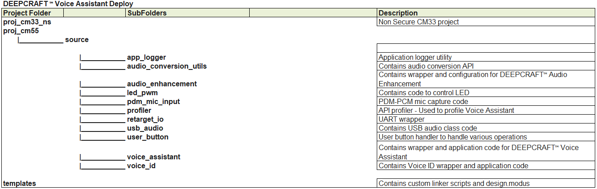
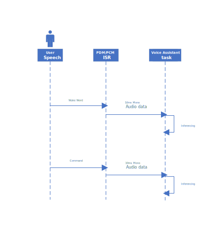
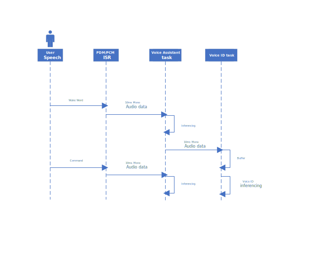
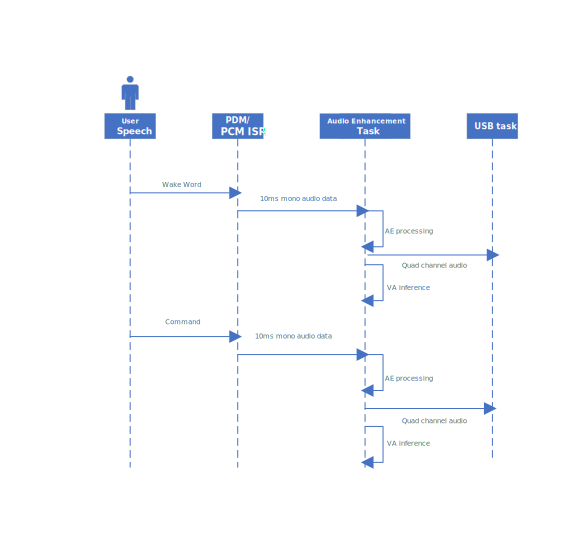
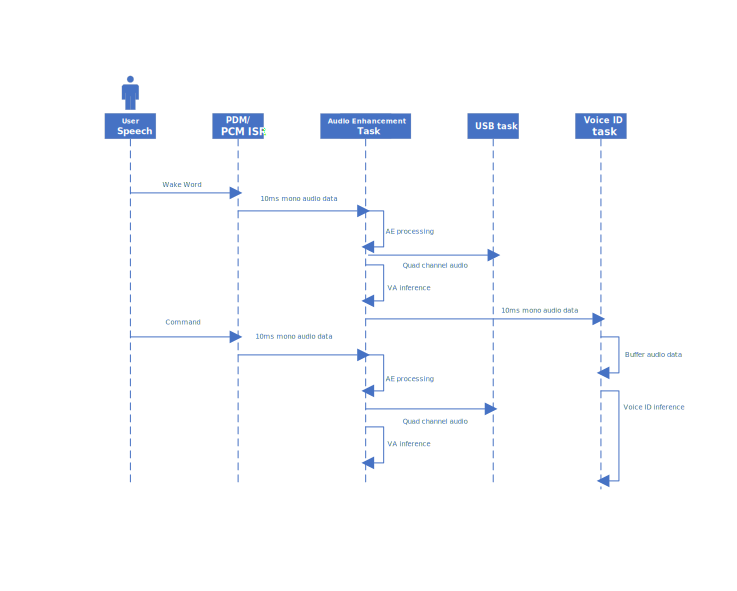
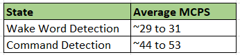

[Click here](../README.md) to view the README.

## Design and implementation

The design of this code example allows you to test models generated by the DEEPCRAFT&trade; voice assistant cloud tool on Infineon's PSOC&trade; Edge MCU devices.
  In the *[common.mk](../common.mk)* file, you can set the `DEEPCRAFT_PROJECT_NAME` used in the cloud tool. By default, this code example uses a pre-generated model to detect the "Coffee Maker" wake word and a set of coffee-maker commands. The following table describes the models that come along with this code example.

**Table 1. DEEPCRAFT&trade; model and wake words**

DEEPCRAFT&trade; project name | Wake word | List of commands 
-----------------------|-----------|-----------------
Coffee (default) | Coffee Maker | See [Coffee maker demo](../proj_cm55/source/voice_assistant/va_models/Coffee/command_list_Coffee.txt)
Smart_Lights_Demo | OK Infineon | See [Smart lights demo](../proj_cm55/source/voice_assistant/va_models/Smart_Lights_Demo/command_list_Smart_Lights_Demo.txt)
LED_Demo | OK Infineon | See [LED demo](../proj_cm55/source/voice_assistant/va_models/LED_Demo/command_list_LED_Demo.txt)
Cooktop_Demo | Hey Cooktop | See [Cooktop demo](../proj_cm55/source/voice_assistant/va_models/Cooktop_Demo/command_list_Cooktop_Demo.txt)

> **Note:** If you are using the LED demo, it adds additional code to control the kit's green LED state and brightness through the commands detected.

### DEEPCRAFT&trade; Voice Assistant Configuration

In the *proj_cm55/source/voice_assistant/va_task.c* file, you can set `#define RUNNING_MODE` to different modes:

- **VA_MODE_WW_SINGLE_CMD:** For every wake word, a single command is detected
- **VA_MODE_WW_MULTI_CMD:** For every wake word, multiple commands can be detected
- **VA_MODE_WW_ONLY:** Only wake word detection is performed
- **VA_MODE_CMD_ONLY:** Only command detection is performed

If using **VA_MODE_WW_SINGLE_CMD** or **VA_MODE_WW_MULTI_CMD** modes, you can set a command timeout by defining the **CMD_TIMEOUT_SINGLE_CMD** and **CMD_TIMEOUT_MULTI_CMD** respectively. These two DEFINES are placed in the *proj_cm55/source/voice_assistant/va_task.c*. By default, they are set to 5000 and 20000 milliseconds.

The main application uses the kit's blue LED to indicate which state the voice assistant is running:
- **LED is ON**: waiting for you to say the wake word
- **LED is breathing**: waiting for you to say the command

### DEEPCRAFT&trade; Audio Enhancement Configuration

The *[common.mk](../common.mk)* file has an option (`USE_AUDIO_ENHANCEMENT`) to enable/disable the DEEPCRAFT&trade; Audio Enhancement.
  
By default, this option is enabled and applies just the High Pass Filter (HPF) and noise suppression algorithm. You can change the configuration via Audio Front End Configurator(AFE) by editing *[AFE configuration file](../proj_cm55/source/audio_enhancement/va_deploy_ae_config.mtbafe)*. 
 

Refer to [Audio Enhancement Application code example design guide](https://github.com/Infineon/mtb-example-psoc-edge-ae-application/blob/master/docs/ae_design_guide.md) on AFE configurator usage.
 

To know more about Audio Enhancement, refer to [AN240916](https://www.infineon.com/AN240916) - DEEPCRAFT&trade; Audio Enhancement on PSOC&trade; Edge E84 MCU
 
If your application requires you to add acoustic echo cancellation (AEC), see the [Audio Enhancement Application code example](https://github.com/Infineon/mtb-example-psoc-edge-ae-application).

This code example provides capability to tune Audio Enhancement components and get 4-channel USB data back to PC which can be used for audio analysis. This capability is available when Audio Enhancement is enabled via *[common.mk](../common.mk)*.

To setup and view the 4 channel USB data, please refer to design guide of [Mains Powered Local Voice Code Example](https://github.com/Infineon/mtb-example-psoc-edge-mains-powered-local-voice/blob/master/docs/local_voice_design_guide.md) 

By default, the examples come with a 15-minute time limited version of the audio enhancement middleware and a 30-minute time limited version of the voice assistant middleware. If you have obtained the unlimited-licensed version, set `CONFIG_VOICE_CORE_MODE=FULL` in the *[common.mk](../common.mk)* file and place the *COMPONENT_AVC_FULL* folder inside the *proj_cm55* project.

### Voice ID configuration

To enable Voice ID, set `CONFIG_VOICE_ID=ENABLED` *[common.mk](../common.mk)*

### Folder Structure

The code example is organized in the following structure.

**Figure 1  Folder Structure**

### Code Flow

This code example has the following code flow. 

1. With Audio Enhancement disabled and Voice ID disabled, the audio packets are sent from PDM mic to VA directly.
In the code see audio_mic_data_feed_cm55() in *proj_cm55/source/pdm_mic_input/audio_feed_interface.c*

**Figure 2 Code Flow with only Voice Assistant**

2. With Audio Enhancement disabled and Voice ID enabled, the code flow is as shown below.

**Figure 3 Code Flow with Voice Assistant and Voice ID**

3. With Audio Enhancement enabled and Voice ID disabled, the audio packets are fed into Audio Enhancement. The Voice Assistant inference happens in the Audio Enhancement output callback.
Refer to audio_mic_data_feed_cm55() in *proj_cm55/source/pdm_mic_input/audio_feed_interface.c* for input and audio_enhancement_process_output() in *proj_cm55/source/audio_enhancement/audio_enhancement_interface.c*

**Figure 4 Code flow with Voice Assistant and Audio Enhancement**

4. With Audio Enhancement enabled and Voice ID enabled, the code flow is as shown below.

**Figure 5 Code flow with Voice Assistant, Audio Enhancement and Voice ID**

### KPI

The *proj_cm55/source/voice_assistant/va_task.c* file also has an option to print the MCPS for the voice assistant process function. Just define `DEFINES+=SHOW_MCPS` in the *proj_cm55/Makefile*. Note that the firmware only prints the MCPS required by the voice assistant process function.

The average MCPS of DEEPCRAFT&trade; Voice Assistant is shown as below,

**Figure 6: MCPS**

